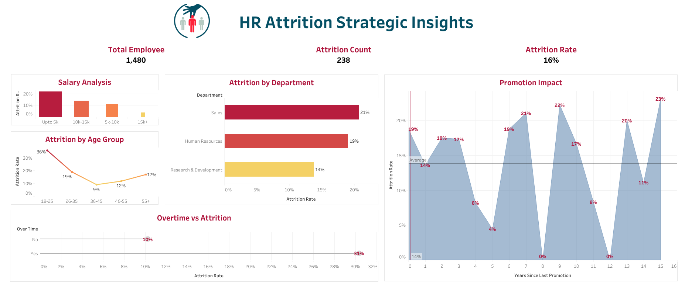

# 🎯 Strategic HR Attrition Analysis

## 🔍 Overview
An end-to-end business intelligence project analyzing human resources data to uncover the critical factors behind employee turnover and provide actionable, data-driven insights for strategic retention planning.

---

## 🖼️ Dashboard Preview

---

## 🛠️ Key Features & Technical Deliverables
* **Comprehensive Data Cleaning:** Processed a dataset of 1,480 employees using Power Query, ensuring data type consistency and removing missing values for accurate reporting.
* **Advanced Interactive Visualizations:** Built a high-fidelity dashboard on Tableau Public featuring Advanced Tooltips to seamlessly explore insights.
* **UI/UX Design Integration:** Focused on premium visual design principles to bridge the gap between complex analytical numbers and clean user readability.
* **Strategic Insights Captured:** Identified low-salary brackets and overtime hours as the primary drivers driving employee turnover.
